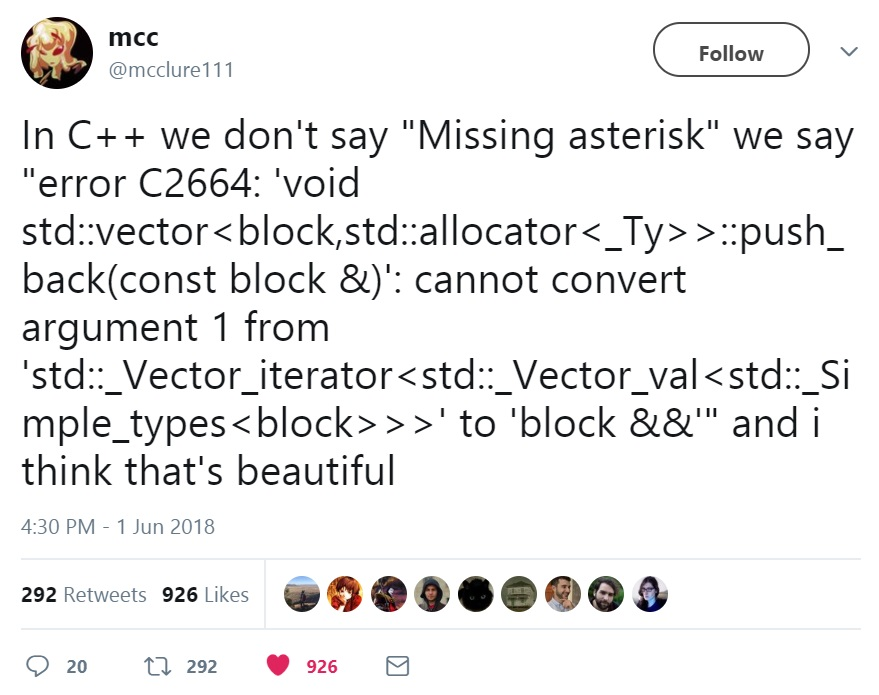
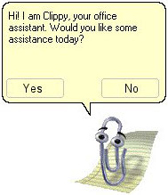

+++
title = "Introduction to Rust"
date = 2025-10-02
weight = 1
[extra]
lesson_date = 2024-10-02
+++

# A language empowering everyone to build reliable and efficient software.

([There's also an unofficial "rustacean" logo.](https://rustacean.net/))

## Why use Rust?

- It is **safe** (compared to C++ for example, as we will see in a minute)
- It is **fast** (because it is compiled to machine code)
- It is ergonomic and pleasant to use (static typing, expressive type system, helpful compiler
  warnings)
- It
  is [loved by programmers](https://insights.stackoverflow.com/survey/2021#section-most-loved-dreaded-and-wanted-programming-scripting-and-markup-languages)
- It provides excellent tooling

## To discuss during class:

- Assuming that someone knows quite a few languages and one wants to implement a new project,
  what is important when deciding which language to pick?
  Find a few criteria where C++ and Python differ. Compare those criteria with Rust (even though our knowledge of Rust is quite limited for now).
- What does it mean that a language is "fast"? Is Python fast (tricky question)?
  Is Java fast? How to compare how "fast" is Rust next to C++?
- What does it mean that a language is "safe"? Is typing enough? What are non-trivial
  ways to make a bug, in C++ and in Python?
- Look into the examples of the source code of the Rust compiler:
  - [a few helper functions](https://github.com/rust-lang/rust/blob/master/compiler/rustc_borrowck/src/path_utils.rs) with short implementations,
  - the [docs](https://doc.rust-lang.org/stable/nightly-rustc/rustc_borrowck/index.html) of this crate,
  - some more complicated code: [match exhaustiveness](https://github.com/rust-lang/rust/blob/master/compiler/rustc_pattern_analysis/src/usefulness.rs),
  - [example PR](https://github.com/rust-lang/rust/issues/83104) that fixes an error suggestion.

## Why learn Rust?

Even if you don't end up using Rust, learning it expands your horizons:

- It helps especially with the awareness of what you can and can't do in concurrent applications.
- It helps you understand memory management and learn its good practices.
- The language is designed to avoid decades-long issues present in other languages.
  It takes [inspiration](https://doc.rust-lang.org/reference/influences.html) from the best parts of other languages
  to avoid the worst parts. Learning them shows what works.

## Why not to learn Rust?

- Some people say Rust is too hard to learn because of the borrow checker and because
  it's irritating to try to compile code while being a beginner.
- Once you get to know Cargo you won't ever want to use a language without a built-in package
  manager.
- You will start hating C++.

## Demos

Let's compare the same code written in [C](errors_demo.c), [C++](errors_demo.cpp)
and [Rust](errors_demo.rs).

## Installing Rust

- [Rustup](https://rustup.rs/)
- Setup an IDE
  - [CLion](https://www.jetbrains.com/clion/) (you can get
    it [for free](https://www.jetbrains.com/community/education/))
    and [RustRover](https://intellij-rust.github.io/)
  - [VSCode](https://code.visualstudio.com/)
    and [rust-analyzer](https://marketplace.visualstudio.com/items?itemName=matklad.rust-analyzer)
  - rust-analyzer also works
    with [other IDEs](https://rust-analyzer.github.io/manual.html#installation)

## Useful tools

- `cargo clippy` (for static analysis)
- there's also `cargo check`, but it's less powerful than clippy
- `cargo fmt` (for code formatting)

### Rust Playground

- [online Rust compiler](https://play.rust-lang.org/)

## Hello world

{{ include_code_sample(path="lessons/old/2021L/01_introduction/hello_world.rs", language="rust") }}

### Variables

{{ include_code_sample(path="lessons/old/2021L/01_introduction/variables.rs", language="rust") }}

### Conditionals

{{ include_code_sample(path="lessons/old/2021L/01_introduction/conditionals.rs", language="rust") }}

### Loops

{{ include_code_sample(path="lessons/old/2021L/01_introduction/loops.rs", language="rust") }}

### Functions

{{ include_code_sample(path="lessons/old/2021L/01_introduction/functions.rs", language="rust") }}

## Test assignment (not graded)

Click [here](https://classroom.github.com/a/l3iF_TJU)

## Obligatory reading

- [The Book, chapters 1-3](https://doc.rust-lang.org/stable/book/)

## Additional reading

- [Rust By Example](https://doc.rust-lang.org/stable/rust-by-example/)
