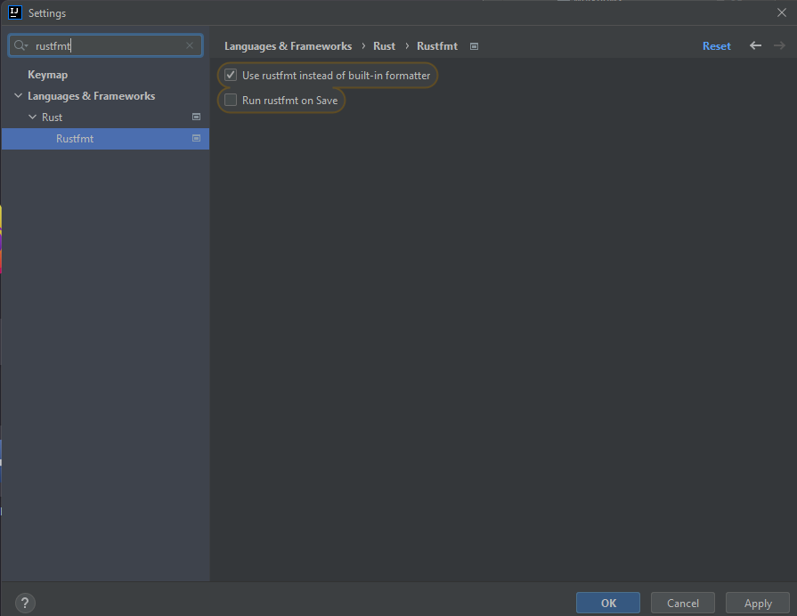

+++
title = "Random things #1"
date = 2022-03-19
weight = 1
[extra]
lesson_date = 2022-04-02
+++

## Constructors

There are no "constructors" in Rust.
[There is exactly one way to create an instance of a user-defined type: name
it and initialize all its fields at once.](https://doc.rust-lang.org/nomicon/constructors.html)

However, we often write associated functions that act as constructors.

In the below example you may notice a new keyword - `pub`. In Rust, almost everything is _private_ by default (exceptions being items in a public `trait` and enum variants in a public `enum`). That means that it can be accessed from within the module it has been declared in, but cannot be accessed from the outside. So far we only worked with a singular file and no additional modules (apart from `tests`) so we didn't have to worry about it.

{{ include_code_sample(path="lessons/7_feedback/constructor.rs", language="rust") }}

## Field initialization shorthand

Note that in the above example, we wrote

```rust
Point { x }
```

instead of

```rust
Point { x: x }
```

## Destructors

If we need a custom destructor, we can implement the `Drop` trait.
Read more [here](https://doc.rust-lang.org/stable/reference/destructors.html).

## Naming

Refer to [this guideline](https://rust-lang.github.io/api-guidelines/naming.html) for naming conventions.

## Underscore

Underscore is used to mark variables that are unused.

```rust
fn example(used: i32, _unused_param: i32) {
    let _unused = 0;

    match used {
        _ => unimplemented!(),
    }
}
```

It should not be used in other contexts.

## Hashmap entry

[entry](https://doc.rust-lang.org/std/collections/struct.HashMap.html#method.entry) is a convenient way to get a mutable reference to a value in a hashmap.

```rust
let mut map = std::collections::HashMap::new();
*map.entry("key").or_insert(0) += 1;
*map.entry("key").or_insert(0) += 1;
assert_eq!(map["key"], 2);
```

## Number conversions

Number conversions are... not the most intuitive.

{{ include_code_sample(path="lessons/7_feedback/number_conversions.rs", language="rust") }}

## Use rustfmt in Clion



## Use clippy in Clion


## Clippy auto-fixing

Clippy can automagically fix some of the issues it detects if run with `cargo clippy --fix`

## Obligatory reading

- [The Book, chapter 7](https://doc.rust-lang.org/stable/book/ch07-00-managing-growing-projects-with-packages-crates-and-modules.html)
