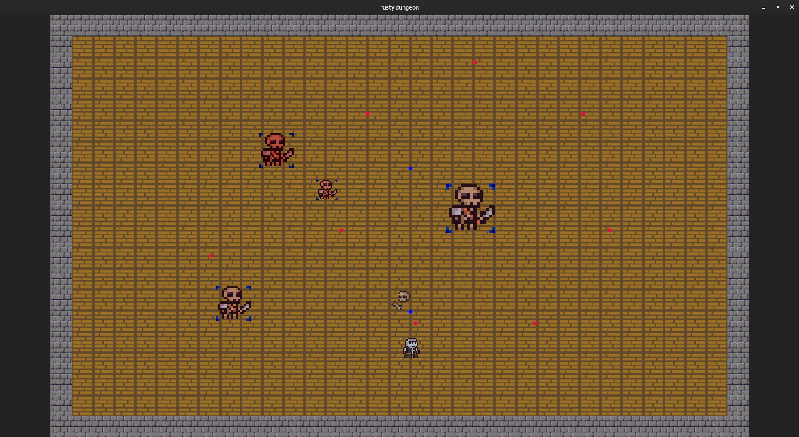
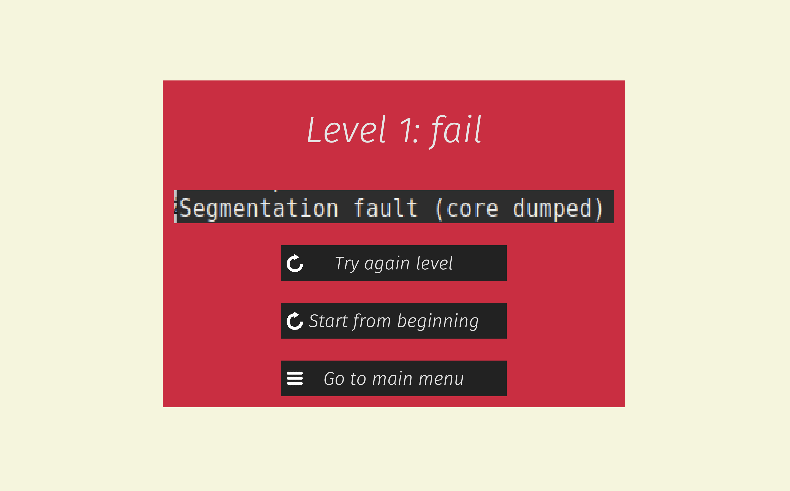
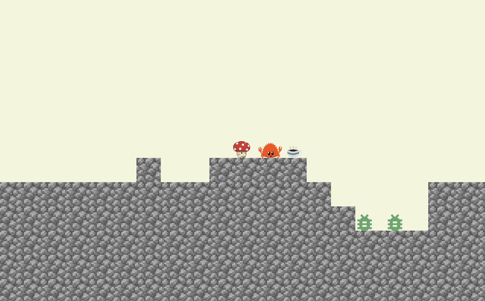

+++
title = "2021L Project showcase"
date = 2022-10-17
weight = 1
[extra]
lesson_date = 2022-10-17
+++

# List of projects

The list of previous students' big projects is [publicly available](https://github.com/orgs/mimuw-jnp2-rust/repositories).

# (Some) projects from the previous semester

## Chat App

[GitHub](https://github.com/barteksad/Chat-App)

Bartłomiej Sadlej (GitHub: @barteksad email: sadlejbartek@gmail.com)

"Chat app written in Rust with Postgress db. Allows users to create new accounts and channels and communicate within channel. All unseed messages from last login are delivered once logged in again.

By default server stats with one user named ADMIN with password ADMIN"

tokio, serde, anyhow, thiserror, dashmap

## Algorithm Visualizer

[GitHub](https://github.com/algorithm-visualzier/algorithm-visualizer)

Mikołaj Piróg (mikolajpirog@gmail.com, GitHub: @aetn23), Mikołaj Wasiak (wasiak.mikolaj1@gmail.com, GitHub: @RudyMis)

Graph editor with algorithms visualization. Create and modify the graph using GUI, move it around using WSAD. To see an algorithm being run, simply click on a node, and select the desired algorithm. See video and/or GitHub page for further details.

Petgraph, egui-tetra, dyn_partial_eq

<video src="/lessons/project-showcase/graph_vis_demo.h264" controls width="320" height="240">
</video>

## Rustal Combat

[GitHub](https://github.com/Emilo77/RUSTAL-COMBAT)

Kamil Bugała (GiHub: @Emilo77)

Simple game in the style of Mortal Combat. Two players fight each other by using dashes. It is the 1 v 1 version, so far it is possible to play on a one computer.

Bevy

## Rusty dungeon

[GitHub](https://github.com/Rusty-Studios/rusty-dungeon)

Barbara Rosiak (GitHub: @barosiak, email basiarosiak.7@gmail.com), Tomasz Kubica (GitHub: @Tomasz-Kubica, email: tomaszkubica4@gmail.com), Dawid Mędrek (GitHub: @dawidmd)

A 2D game written using Rust and Bevy Game Engine, in which the player has to shoot and defeat enemies on their way to the final boss, inspired by the Binding of Isaac.

Bevy

## MarioMIM

[GitHub](https://github.com/KatKlo/rust-MarioMIM)

Katarzyna Kloc (GitHub: @KatKlo, email: kk429317@students.mimuw.edu.pl, linkedin: https://www.linkedin.com/in/katarzyna-kloc-7a7503209/),
Patryk Bundyra (GitHub: PBundyra, email: pb429159@students.mimuw.edu.pl, linkedin: https://www.linkedin.com/in/pbundyra/)

Since the moment CLion has shown us the first segfaults, we wanted to create a computer game inspired by the student’s adventure of pursuing a Computer Science degree. MarioMIM is a platform game whose main goal is to... get a degree. We’ve implemented a game inspired by Super Mario Bros, but in the special University of Warsaw edition. In order to overcome bugs, the student can strengthen himself by drinking coffee or learning the best programming language in the world - Rust.

Bevy, Rapier, Kira

## Sendino

[GitHub](https://github.com/grzenow4/project-sendino)

Grzegorz Nowakowski (Github: @grzenow4, email: g.nowakowski@student.uw.edu.pl) with @izmael7 on Github

One room chat application with client-server model of communication. Many users can communicate at one time.

Tokio, serde, crossterm

## Chatter

[GitHub](https://github.com/kfernandez31/JNP2-Chatter)

Kacper Kramarz-Fernandez (GitHub: @kfernandez31, email: kacper.fernandez@gmail.com),
Jan Zembowicz (GitHub: @JWZ1996, email: janzembowicz@gmail.com)

Chatter is a simple multi-room command-line chat application that uses a two-protocol (HTTP + WS) communication style for high-efficiency.

Tokio, Warp, Serde, Hyper, among others
